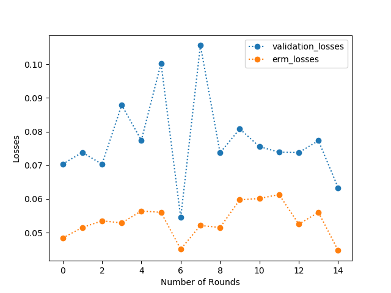
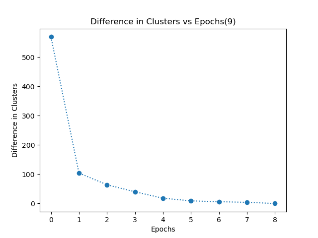
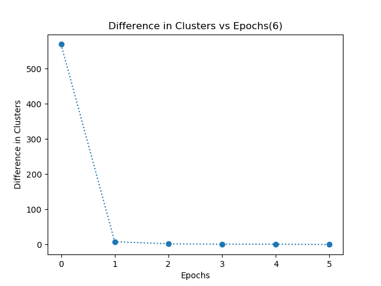
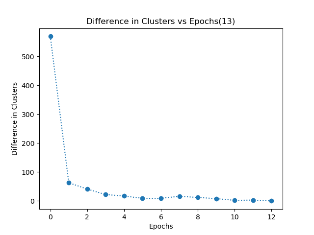

# ML Algorithms from scratch Python (Learning Repository)

This repository contains the implementations of popular Machine Learning Algorithms in python without using in-built libraries.

- Perceptron Learning Algorithm (perceptron.py)
- Adaptive Boosting Algorithm (adaBoost.py)
- K-Means Clustering (kmeans.py)
- K Nearest Neighbour Classifier (knn.py)
- Support Vector Machine Classifier (svm.py)

## Datasets Used

- Breast_cancer_data.csv
- linearly-separable-dataset.csv

### Perceptron Learning Algorithm
- Dataset: linearly-separable-dataset.csv / Breast_cancer_data.csv
- Mode: erm / kfold (For cross validation, number of folds = 10 by default)
- Epochs: Integer variable

#### Observations
- The algorithm terminated on its own after I ran some epochs for the linearly-separable dataset. The algorithm gets converged when the training error (empirical risk minimization) comes out to be 0. This algorithm terminated because perceptron algorithm handles only linearly separable datasets.
- The heuristic that I took for the termination of the algorithm is by comparing the training error of four consecutive epochs. When the error remains constant then I terminate it.
- For the breast_cancer_dataset, the algorithm did not converge i.e. it did not terminate as intended.
- As per the experiments, breast_cancer_dataset is not linearly separable so this is the reason why the algorithm did not terminate.
- Training Error did not converge to 0, so we can infer that the algorithm for this dataset will not converge since breast_cancer_data is not linearly separable.
- The runtime of linearly-separable is less compared to breast_cancer_data since breast_cancer_data is not linearly separable.

### Adaptive Boosting Algorithm
- Mode: erm / kfold (For cross validation, number of folds = 10 by default) / plot (for plotting graph b/w ERM and Validation error vs Rounds)
- Rounds: Integer variable

#### Observations
- As you can see that the plot (Figure 1) below clearly depicts that the validation loss is at all times more than the empirical loss.
- This behaviour shows that the training folds yield less loss compared to the test folds. According to the figure, I would recommend 15-20 rounds(epochs) to clearly show the difference between the empirical and validation loss.

### K-Means Clustering
- dataset: Breast_cancer_data.csv
- distance: default='euclidean' otherwise it takes values as 'cosine', 'manhattan'

#### Observations
- My k-means algorithm converges when each data point in the dataset has the same cluster allocation for consecutive 2 epochs. I have even plotted a graph of difference in clusters vs epochs. This graph shows the number of data points which have different clusters in two consecutive epochs.

***Euclidean***

***Manhattan***

***Cosine***

- I observed that when k=2 i.e. when we have to divide the dataset into 2 clusters, each cluster can clearly divide the dataset into 2 clusters based on the diagnosis label. This is shown in the table below. I have calculated the percentage of data points having 0 as diagnosis in both the clusters and similarly, diagnosis of 1 in both the clusters.

### K Nearest Neighbour Classifier
Required arguments:
- dataset: Breast_cancer_data.csv
- k: number of neighbours
- epochs: Integer variable

#### Observations
- I have normalized the dataset to prevent biasing of features and I have split the dataset into 80% training and 20% testing. 
- Evaluation of dataset is done by predicting the label of each test instance.
- Prediction of each instance is done by calculating the euclidean distance of each test instance with all the data points in training data.
- Then sorting the distance in ascending order and extracting the labels of the first k data points.
- The final label of test instance is the majority label of its k nearest neighbours that I extracted in the previous step.
- This is how I evaluated all my testing instances. 
- Accuracy is calculated by comparing the predicted label and actual label of the respective testing instance.
- Obtained an accuracy of around 89% - 93%.
- To generalize the accuracy, I have done this for a number of epcochs, then calculated the average accuracy over epochs.

### Support Vector Machine Classifier

